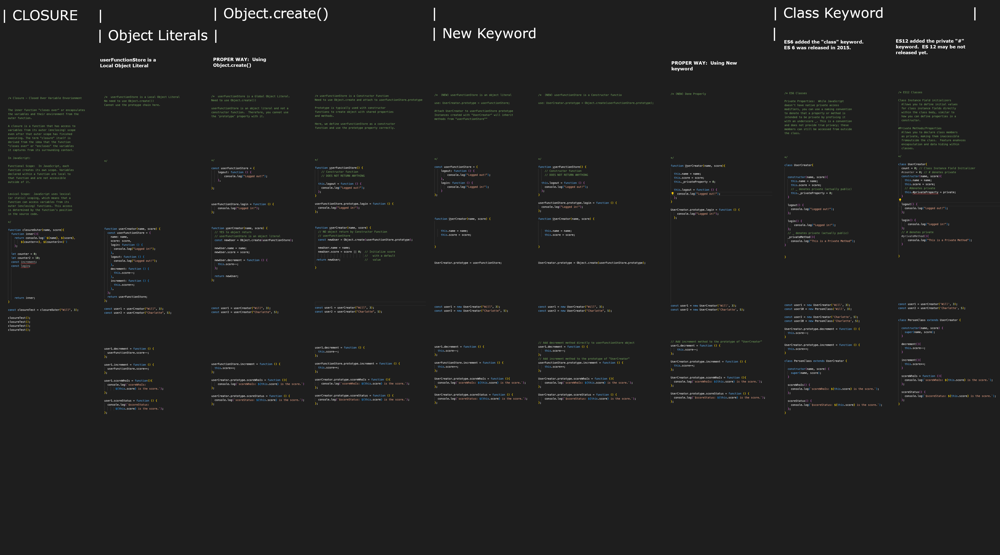

#  learn-oopClosure

Use the files in /js directory to, using screenshots, generate an image that compares OOP with closure in JS.

Once the files in the /js directory are modified and screenshots made use the /GIMP_files folder.  GIMP_files folder contains information the GIMP Image editor *.xcf file to create a large file comparing everything side-by-side.

